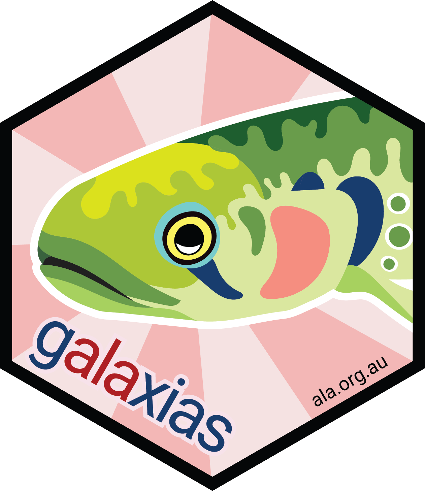

```{r}
#| include: false
library(htmltools)
source(here::here("..", "R", "html_functions.R"))
```

::: {.column-screen style="background-color: #FFFFFF; padding-top: 50px; margin-top: -4vh"}

::: {.column-page layout-ncol=2 layout-align=center}

{width=400px style='margin-left:auto;margin-right:auto;'}


# galaxias

galaxias is an interface designed to simplify the process of converting biodiversity data into Darwin Core Archives (DwCA), facilitating data submission to infrastructures such as the Atlas of Living Australia (ALA) or the Global Biodiversity Information Facility (GBIF).
<br>
<br>
If you have any questions, comments, or spot any bugs, [email us](mailto:support@ala.org.au) or [report an issue in the R package](https://github.com/AtlasOfLivingAustralia/galaxias) or [the Python package](https://github.com/AtlasOfLivingAustralia/galaxias-python) on our GitHub page.

:::

:::


:::{.column-screen}

:::{.column-page style="padding-top: 30px;"}

::: {.grid}
::: {.g-col-lg-6 .g-col-12}

```{r}
#| echo: false

add_button(
  text = "R",
  url = "http://galaxias.ala.org.au/R"
)
```


```{r}
#| eval: false
library(galaxias)

# standardise data
my_data_dwc <- df |>
  set_occurrences(occurrenceID = composite_id(location_id, 
                                              sequential_id()),
                  basisOfRecord = "humanObservation") |> 
  set_coordinates(decimalLatitude = latitude, 
                  decimalLongitude = longitude) |>
  set_locality(country = "Australia", 
               locality = "Canberra") |>
  set_scientific_name(scientificName = species, 
                      taxonRank = "species") |>
  set_taxonomy(kingdom = "Animalia", 
               phylum = "Aves")

use_data(my_data_dwc)        # add data to directory

# build metadata
use_metadata_template("metadata.Rmd")
use_metadata("metadata.Rmd") # add metadata to directory

# package for release
build_archive("my_dwca.zip") # convert to DwCA
check_archive("my_dwca.zip") # validate with GBIF quality checks
submit_archive()             # open submission page
```


:::

::: {.g-col-lg-6 .g-col-12}

```{r}
#| echo: false

add_button(
  text = "Python",
  url = "http://galaxias.ala.org.au/Python"
)
```


```{python}
#| eval: false
import galaxias

# standardise data
my_data_dwc = galaxias.set_occurrences(occurrences = df, 
                                       occurrenceID = ['location_id','sequential'],
                                       basisOfRecord = 'humanObservation')
my_data_dwc = galaxias.set_coordinates(occurrences = my_data_dwc,
                                       decimalLatitude = 'latitude',
                                       decimalLongitude = 'longitude')
my_data_dwc = galaxias.set_locality(occurrences = my_data_dwc,
                                    country = 'Australia',
                                    locality = 'Canberra')
my_data_dwc = galaxias.set_scientific_name(occurrences = my_data_dwc,
                                           scientificName = 'species',
                                           taxonRank = 'species')
my_data_dwc = galaxias.set_taxonomy(occurrences = my_data_dwc,
                                    kingdom = 'Animalia',
                                    phylum = 'Aves')


galaxias.use_data(my_data_dwc)        # add data to directory

# build metadata
galaxias.use_metadata_template()
galaxias.use_metadata()               # add metadata to directory

# package for release
galaxias.build_archive("my_dwca.zip") # convert to DwCA
galaxias.check_archive("my_dwca.zip") # validate with GBIF quality checks
galaxias.submit_archive()             # open submission page
```

:::

:::

:::
:::
